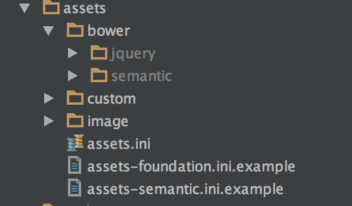

[Back](https://github.com/swader/nofw) -> Front end documentation

## Front End Aspects

This project is completely NodeJS-free, which means you don't need any of its ridiculous dependencies and build toolchains installed. Everything can still be PHP. The approach from [this post](http://www.sitepoint.com/look-ma-no-nodejs-a-php-front-end-workflow-without-node/) is mainly used, but here's a recap of everything you need to know:

### BowerPHP

For installing front end assets, it's recommended you use [BowerPHP](http://www.sitepoint.com/bower-vs-bowerphp/). It is already installed as part of this app's dependencies.

*Note that since BowerPHP is not marked stable, you need to lower the minimum stability of your Composer environment. This is already done in this project - see `composer.json`.*

By default, all assets installed with BowerPHP will go into `assets/bower`. This can be changed in the `.bowerrc` file in the root of the project. Assets are installed like so:

```bash
vendor/bin/bowerphp install foundation-sites --save
```

The `--save` flag is there to make sure BowerPHP generates a `bower.json` file which will remember that we wanted Foundation installed. This way, one can just run `vendor/bin/bowerphp install` next time the project is being bootstrapped elsewhere without specifying all the needed assets. You should also modify the author and the project name in `bower.json` directly.

*Note that since these assets will be installed outside the `public` directory, they will be inaccessible to the server and thus unsuitable for direct inclusion into templates. To be able to use them, either change the default installation location to something like `public/bower` and then link to them there, or use a build process (see below).*

### Building with Mini-asset

We'll use the previously installed [SemanticUI](http://semantic-ui.com) for all further examples of asset compilation. SemanticUI is an extremely pretty and versatile alternative to Bootstrap.

The above bower command installed Semantic into two folders into `assets/bower`:



While this is a lot of files, only a few are needed to make things work, and those are mainly in the various `dist` subfolders. We need:

- `jquery.js` to power `semantic.js`
- `semantic.js` to power the interactive JavaScript elements of Semantic
- `semantic.css` to get the Semantic styles


The order is important, because those lower in the list depend on those higher in the list. Technically, you could now copy these files into `public` and just include them in the HTML as regular JS and CSS files, and everything would work. However, we want to automate things, and we want to turn the files into one compressed file, for faster page loading. This is where [mini-asset](https://github.com/markstory/mini-asset/) comes in. It is already installed in this project.

Mini-asset is a tool which takes certain files, runs them through specific filters, and saves the output as modified files. In our case, we want it to:

- join and compress the JS files
- join and compress the CSS files

Which files are to be processed in which way is configured in `assets/assets.ini`, a currently empty file. The following configuration takes care of things for us:


```ini
; This is how assets.ini should be configured if you install SemanticUI

[css]
cachePath = public/dist/css
paths[] = assets

[js]
cachePath = public/dist/js
paths[] = assets

[app.dev.css]
files[] = bower/semantic/dist/semantic.css
files[] = custom/css/style.css

[app.min.css]
extend = app.dev.css
filters[] = CssMinFilter

[app.dev.js]
files[] = bower/what-input/what-input.js
files[] = bower/jquery/dist/jquery.js
files[] = bower/semantic/dist/semantic.js
files[] = custom/js/app.js

[app.min.js]
extend = app.dev.js
filters[] = JsMinFilter
```

This same sample configuration can also be seen in `assets/assets-semantic.ini.example`.

Here's what it means, in order:

- for all things CSS, save the compiled files into what's under `cachePath`, and look for files to compile in all the paths specified under `paths[]`.
- same for JS
- save the files under `files[]` into a combined file `app.dev.css`. Due to the above setting, the will result in the file `public/dist/css/app.dev.css` being created.
- extend the above CSS file's settings by adding another filter on top - compression. So squeeze that file as much as you can by removing whitespace, comments, and other irrelevant data. Save it as `app.min.css` (for minified). Use the pre-installed `CssMinFilter`.
- merge the following JS files into `app.dev.js`
- minify this one too, into `app.min.js` with the pre-installed `JsMinFilter`

You may be wondering why we're doing two steps here - a minified and a dev version of the CSS / JS. That's because during development, we'll be using the `dev` files so we can debug easily - opening the site's JS and CSS in Chrome's dev tools will be a breeze. Then, once we're ready to optimize for performance, we just switch to `min` versions and speed up our site's load speed.

To actually execute these instructions, we run:

```bash
vendor/bin/mini_asset build --config assets/assets.ini
```

This will create the two files we mentioned earlier. They can now be included in the HTML of the project with `<link>` and `<script>` tags as needed.

To make changes to the application's JavaScript or CSS, edit `assets/custom/js/app.js` and `assets/custom/css/style.css` respectively. The files in `assets/bower` are **not** to be edited.

### Automation with Robo

Manually running the above build command every time a file changes might be somewhat tedious. Hence, you can use the pre-installed Robo task runner. In fact, the above build task has already been configured for you in `assets/RoboFile.php`:

```php
<?php
/**
 * This is project's console commands configuration for Robo task runner.
 *
 * @see http://robo.li/
 */
class RoboFile extends \Robo\Tasks
{
    public function assetsWatch()
    {
        $this->taskWatch()
            ->monitor('assets', function () {
                $this->assetsBuild();
            })->run();
    }
    public function assetsBuild($opts = ['clear' => false])
    {
        $this->say(date('H:i:s').": starting rebuild");
        if ($opts['clear']) {
            $this->say(date('H:i:s').": Clearing old files!");
            $this->_exec('vendor/bin/mini_asset clear --config assets.ini');
        }
        $this->_exec('vendor/bin/mini_asset build --config assets.ini');
        $this->say(date('H:i:s').": rebuild done!");
    }
}
```

The `assetsWatch` method is the one which will be keeping an eye on file changes. Notice how it monitors the entire `assets` folder. This might become a bit sluggish when there are many files in that folder, so it's best to be more specific when more dependencies are installed.

The `assetsBuild` method is one you can run manually to build assets, instead of the `mini_asset` command from the previous section, but is also the one being run by `assetsWatch` when a change is detected. Some helpful output messages are in place, too, so you know how long a build took, etc.

To tell Robo to keep an eye on the files and restart the build on every change, first modify the list of files/folders to watch in `RoboFile.php`, and then run:

```bash
vendor/bin/robo assets:watch
```

To manually rebuild the assets, i.e., to re-run the `mini_assets` command we covered before, run:

```bash
vendor/bin/robo assets:build
```

To build assets but also delete the previously created ones first, run:

```bash
vendor/bin/robo assets:build --clear
```

In most cases, you'll just run `watch` and leave it be.

While developing, if you find other automatable tasks, feel free to add them to the RoboFile - it can accommodate almost anything, as you can see [in the docs](http://robo.li/started/).
